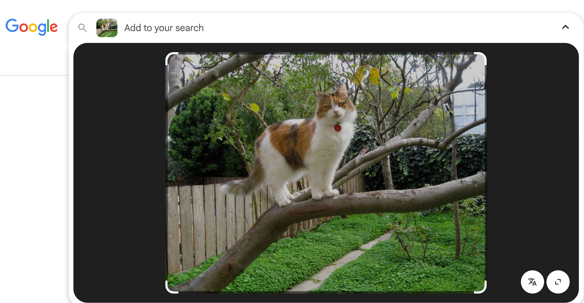
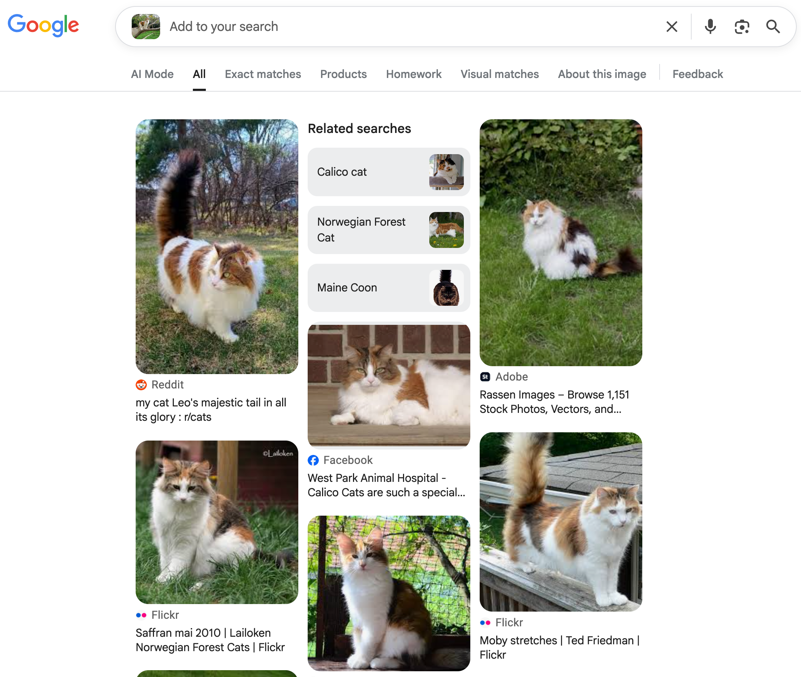
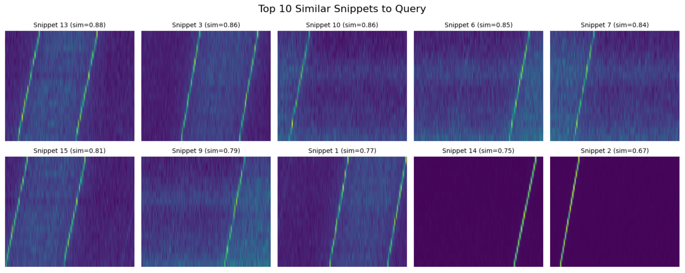

# 🛰️ Voyager 1 Machine Learning Tutorial

# [CLICK HERE to open the interactive notebook in Google Colab to go through the full tutorial!](https://colab.research.google.com/github/elanlavie/VoyagerMLTutorial/blob/main/VoyagerMLTutorial.ipynb)

## 👋 Introduction
The goal of this tutorial is to learn how to use Artifical Intelligence to find Extraterrestrial Intelligence! Woah--That's a lot of intelligence! 🧠🤯

We'll take real radio wave data from outer space collected by [Breakthrough Listen](https://breakthroughinitiatives.org/initiative/1) at the [Green Bank Telescope](https://en.wikipedia.org/wiki/Green_Bank_Telescope) in West Virginia and use a machine learning algorithm to see if any of it looks like a possible alien message!

Spoiler alert: As in the [turboSETI tutorial](https://github.com/elanlavie/VoyagerTutorial/blob/master/VoyagerTutorial.ipynb), you WILL find what appears to possibly be an alien! 👽

Double spoiler alert: Again, it's not an alien, but IS [Voyager 1 🛰️](https://en.wikipedia.org/wiki/Voyager_1), the farthest human-made object from Earth! Which remains very freaking cool!

## 📚 Background
We aim to find signals that look similar to a given “query” signal in Voyager's spectrograms. This is a lot like a [reverse Google Image Search](https://images.google.com) if you've ever tried that!

For example, if you wanted to find an image of another beautiful orange/gray spotted calico cat, you could upload your image to Google Image Search:

  

 and it will return look-alike kitties: 

  

 We'll be doing something very similar, but instead of uploading an image of a cat, we'll upload an image of a signal we believe looks like the one Voyager (or an alien!) emits: 

  

Then the machine learning algorithm, called a **Beta-Variational Autoencoder (β-VAE)**, will look through a bunch of data that we want it to search through for similar looking signals! If all goes well, it will return the top 10 lookalikes ("hits"), which we can then check out for ourselves to see if they really are extraterrestrial spacecraft!! (Or, more likely, Radio Frequency Interference from Earth-based satellites/wi-fi/cell phones/microwave ovens/whatever). Here's an image of what the top 10 hits for the signal above might look like:

  

And that's all there is to it! To better understand how the machine learning algorithm works, it may be helpful to watch:

1) This wonderful video from Carnegie Mellon University to develop one's intuition on "latent space": [Cat's in Latent Space](https://www.youtube.com/watch?v=hb-KT66rCT8) :)
2) This short video on Convolutional Neural Networks (like a β-VAE): [Convolutional Neural Networks](https://www.youtube.com/watch?v=LEAFHHNk8II)
3) This longer 3Blue1Brown video on Neural Networks more generally: [But What is a Neural Network?](https://www.youtube.com/watch?v=aircAruvnKk)

## 🗺️ Overview
We follow a simplified version of the method by Ma et al. (2023). First, we use an energy detection approach to extract small signal snippets from the full spectrogram – essentially finding time-frequency patches with power significantly above the noise floor. These snippets (for example, containing narrowband Doppler-drifted carrier signals) will be our “catalog” of candidate signals. Next, we load a pretrained β-Variational Autoencoder (β-VAE) encoder model based on the one created by Peter Ma et al (same weights, but probably a slightly different architecture). This neural network encodes each spectrogram snippet into a low-dimensional latent feature vector that captures its salient morphological features (shape, bandwidth, drift rate, etc.). Finally, given a selected query snippet, we compute the cosine similarity between the query’s embedding and all other snippet embeddings to retrieve the most similar signals. We will display the top 10 matches as images and discuss the results.

*Note: The dataset consists of six 5-minute scans of Voyager 1 acquired by the Green Bank Telescope in July 2020 (3 scans pointed ON the Voyager spacecraft and 3 OFF target). For simplicity, we will ignore the ON/OFF labeling (i.e. we won’t perform interference filtering by removing OFF-target signals). Instead, we’ll treat all scans uniformly as a pool of spectrogram data in which to search for lookalike signals.

## ✅ Requirements
This notebook uses TensorFlow (with GPU support) and common scientific Python packages (NumPy, h5py, etc.) which are pre-installed in Colab. We will also install Blimpy (Breakthrough Listen I/O toolkit) to help read .h5 spectrogram files. The β-VAE encoder model will be downloaded and loaded with Keras. Let's get started by importing necessary libraries and preparing the data!
