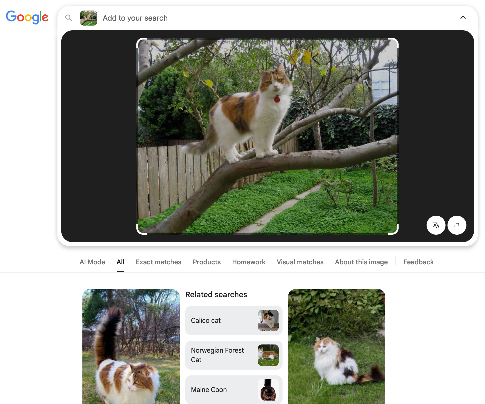

# 🛰️ Voyager Signal Similarity Search with β-VAE (Colab Tutorial)

# [CLICK HERE to open the notebook in Google Colab in your browser!](https://colab.research.google.com/github/elanlavie/VoyagerMLTutorial/blob/main/VoyagerMLTutorial.ipynb)

## 👋 Introduction
In this tutorial, we will use real Voyager-1 radio spectrogram data from the Breakthrough Listen public archive to demonstrate a content-based signal search. We aim to find signals that look similar to a given “query” signal in Voyager's spectrograms. This is a lot like a reverse Google Image Search if you've ever tried that!

  

For example, if you wanted to find an image of a cat that looks a lot like this one: 

  

The dataset consists of six 5-minute scans of Voyager 1 acquired by the Green Bank Telescope in July 2020 (3 scans pointed ON the Voyager spacecraft and 3 OFF target). For simplicity, we will ignore the ON/OFF labeling (i.e. we won’t perform interference filtering by removing OFF-target signals. Instead, we’ll treat all scans uniformly as a pool of spectrogram data in which to search for lookalike signals.

## 📚 Background
It may be helpful to watch this wonderful video from Carnegie Mellon University to develop one's intuition on "latent space" in a machine learning context: [Cat's in Latent Space](https://www.youtube.com/watch?v=hb-KT66rCT8) :)

## 🗺️ Overview
We follow a simplified version of the method by Ma et al. (2024). First, we use an energy detection approach to extract small signal snippets from the full spectrogram – essentially finding time- frequency patches with power significantly above the noise floor 4 . These snippets (for example, containing narrowband Doppler-drifted carrier signals) will be our “catalog” of candidate signals. Next, we load a pretrained β-Variational Autoencoder (β-VAE) encoder model provided by Peter Ma et al. This neural network encodes each spectrogram snippet into a low-dimensional latent feature vector that captures its salient morphological features (shape, bandwidth, drift rate, etc.). Finally, given a selected query snippet, we compute the cosine similarity between the query’s embedding and all other snippet embeddings 5 to retrieve the most similar signals. We will display the top 10 matches as images and discuss the results.

## ✅ Requirements
This notebook uses TensorFlow (with GPU support) and common scientific Python packages (NumPy, h5py, etc.) which are pre-installed in Colab. We will also install Blimpy (Breakthrough Listen I/O toolkit) to help read .h5 spectrogram files. The β-VAE encoder model will be downloaded from Peter Ma’s GitHub repository and loaded with Keras. Let's get started by importing necessary libraries and preparing the data.
